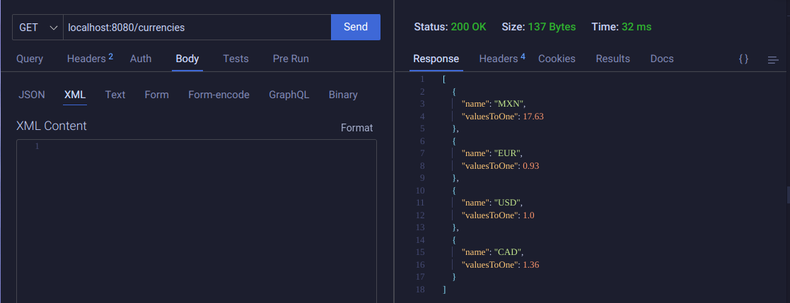
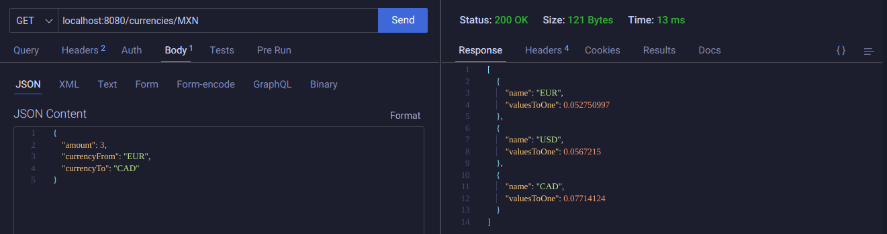
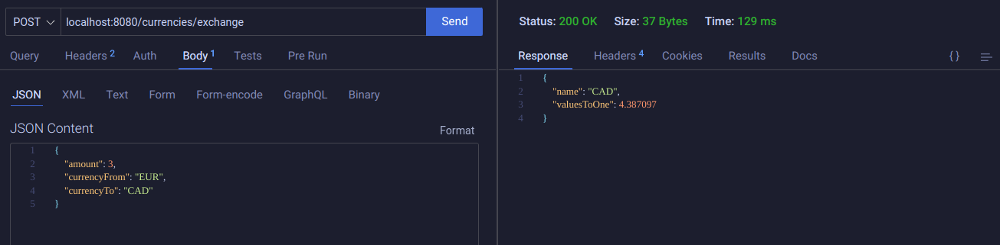

# Reto Sesion 4

## Crear un API REST sobre tipos de cambio.

### **Listar las divisas disponibles.**

> *Las divisa que se incluyeron son ["USD", "MXN", "EUR", "CAD"], y el valor base fue el del USD.*

Para poder consultar esta lista se debe de ingresar a esta ruta url, con el método get

> **GET:** /currencies

Ejemplo:



### **Listar todas las divisas con respecto a una en particular.**

Para poder hacer esta operación se debe ingresar a esta dirección url,con el método get

> **GET:** /currencies/MXN

En este caso la variable que usaremos se pasa a través de la url, en la ultima sección de esta, en este caso es ***MXN***

Ejemplo:



### **Obtener el cambio de una divisa a otra.**

Para poder hacer esta operación se debe ingresar a esta dirección url, con el método post

> **POST:** /currencies/exchange

Para poder mandar los parámetros, usaremos un objeto, el cual mandaremos por medio de JSON

```
{
    "amount": "3",
    "currencyFrom": "EUR",
    "currencyTo": "CAD"
}
```

1. amount: *Cantidad a cambiar.*
2. currencyFrom: *Divisa de origen.*
3. currencyTo: *DIvisa deseada.*

Ejemplo:


